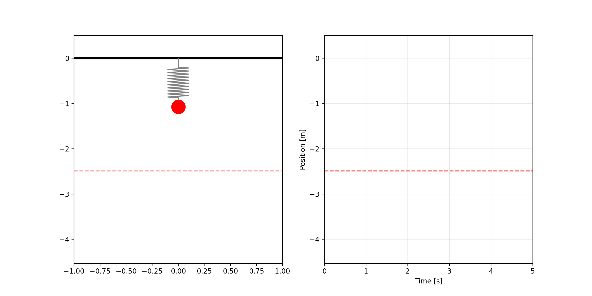
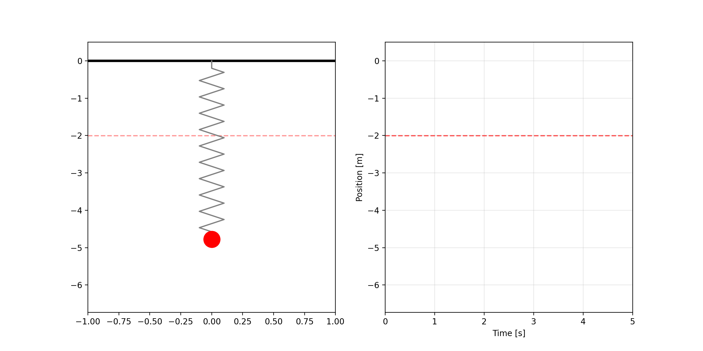

# 「コンピュータシミュレーション入門（仮）」 or 「物理現象をプログラミングで解いてみよう（仮）」
この授業では、計算用プログラムを自身の手で作成しながら、コンピュータシミュレーションを体感してもらいます。ものづくり系エンジニアになるにあたって重要なスキルとなるシミュレーション技術の基礎を学んでもらいます。

## 背景
### 実社会で扱う物理現象
- 高校物理では、数式で解くことができる（厳密解を求めることができる）問題が扱われてきた。
- 実際の現象はかなり複雑で、簡単に数式で扱うことが難しい。
  - 例：自動車の設計・開発
    - タイヤと路面の接触、サスペンション、たくさんの部品との結合、…
- 複雑な物理現象を扱う際には、コンピュータシミュレーションが用いられる。
  - 製造業
    - 目標性能を満たしているか。
    - 製品はどのような挙動を示すか観察
  - ゲームエンジン
    - ゲーム内の物体が物理法則に従い動く
### この講座の目的
- ものづくり系エンジニアになるにあたって重要なシミュレーション技術を学ぶ入り口となるような教材を提供したい。
  - 計算用プログラム作成を通してシミュレーションを体感してもらう。
  - 機械のシミュレーションやゲームエンジンなどがどのように動いているのかを想像しやすくなる。

## 講座の内容
### 概要
- バネの振動を題材に、計算用プログラムを自身の手で完成させてもらう。
  - 運動方程式 ($ma = F$) を数値解法（オイラー法）を用いて解いています。
  - 結果のグラフやアニメーションを出力・保存



### 計算用プログラム

Python パッケージ管理ツールとして `uv` を使っています。

```bash
# uvのインストール
brew install uv

# Pythonのインストール
uv python install

# リポジトリのクローン
git clone https://github.com/hirotakasuzuki1219/python_sim.git
cd python_sim

# 仮想環境の作成とライブラリのインストール
uv venv
uv pip install -r requirements.txt

# プログラムの実行
uv run python main.py
```

### シミュレーションの注意点について理解してもらう
#### 失敗例：不適切な条件設定による誤差、発散



#### 実験との比較
- 実験概要
  - バネでおもりをぶら下げて振動させ、シミュレーション結果と比較
    - 振動周期で比較
    - （できればおもりの変位も取得したいが難しそう）
- 実現象との違い
  - 実際のバネはフックの法則（ $F = kx$ ）が成り立っているか？
  - 実験でシミュレーション通りまっすぐ落とせるか？
  - バネはずっと振動しているか？（減衰、空気抵抗、…）

### 製品設計を体験し、シミュレーションの意義を学んでもらう
#### 例：バンジージャンプのゴム
- 着水せず、かつ体への衝撃が少ないゴムの条件は？

## 授業計画（仮）
| 回 | タイトル | 内容 |
| :---: | :--- | --- |
| 1 | はじめに | シミュレーションとは？ |
| 2 | Pythonの文法の紹介 | Forループ、四則演算、… |
| 3 | アニメーション・グラフの作成 | Matplotlibを使った等速直線運動の描画 |
| 4 | 運動方程式の導入($ma = F$) | 自由落下シミュレーション |
| 5 | バネを導入したシミュレーション | フックの法則（ $F=kx$ ）の導入 |
| 6 | シミュレーションで生じる誤差 | 不適切な条件設定による発散 |
| 7 | 実験との比較 | バネの鉛直振り子の実験 |
| 8 | 計算モデルの拡張 | 減衰、空気抵抗など |
| 9 | ソルバーの拡張 | ルンゲクッタ法 |
| 10 | シミュレーションで振動現象を観察しよう | 強制振動、共振 |
| 11 | 製品設計を体験してみよう | バンジージャンプ用ゴムの設計（or サスペンションの設計） |
| 12 | まとめ | シミュレーションの魅力・注意点、発展的なシミュレーションの紹介 |

## 今後の展望
この授業で学んだことを基に、以下のような授業へと発展させたい。
### 既存の物理エンジンを活用したシミュレーション
- 実際の開発では、複雑な物体の運動方程式を解くのに既存のソルバーを使うことが多い
  - UnityのNvidia PhysX、 Pybulletなど
  - 車を作って走らせる？
### ものづくりへの応用
- ロケット開発
  - どうやったら大気圏を脱出できるかな？
  - 空気抵抗や重力、燃料の噴出、打ち上げ角度を考慮に入れたシミュレーション
- 倒立振り子ロボットの開発
  - どうやったら転ばない倒立振り子ロボット（セグウェイみたいなやつ）が作れるかな？
  - シミュレーション上で制御値を定めて、実際に模型で試してみよう
- タワーの開発
  - 地震に強い建物構造は何か？
  - 可能であれば実験
- 渋滞シミュレーション
  - どんな走り方なら渋滞が起きにくいだろう？