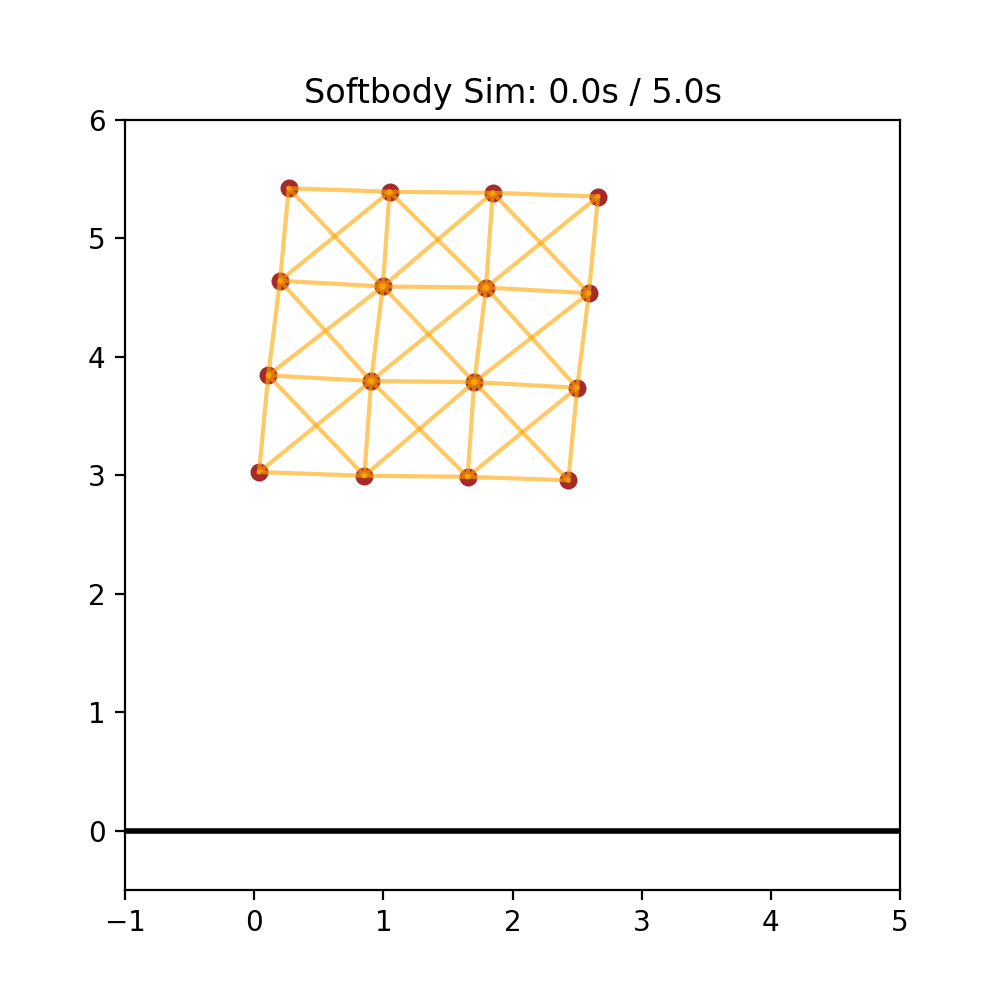
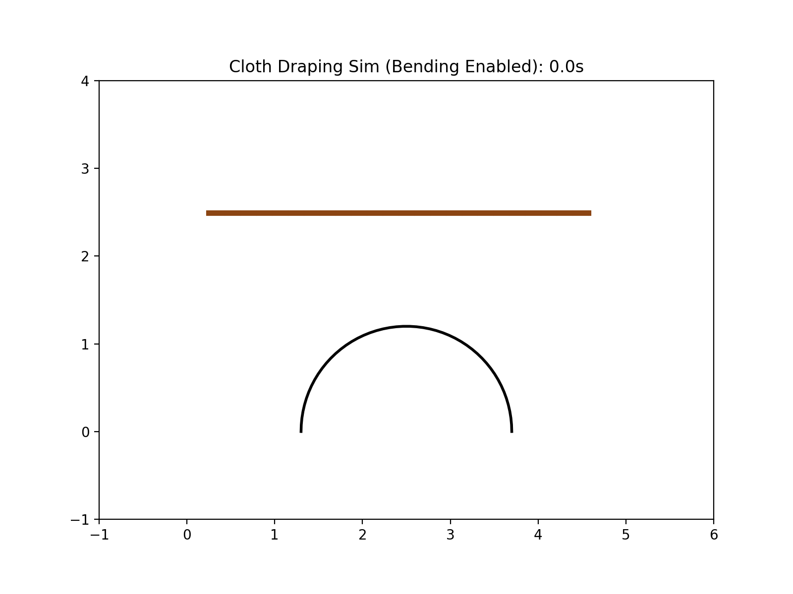

# 「コンテンツ制作のための物理シミュレーション入門（仮）」
この授業では、計算用プログラム(Python)を自身の手で作成しながら、コンピュータシミュレーションを体感してもらいます。最終的には、Blenderの物理演算機能を用いた簡単なアニメーション制作を行なってもらいます。

## 背景
### シミュレーション技術の活用
- 複雑な物理現象を扱う際には、コンピュータシミュレーションが用いられる。
  - **製造業・建設業**
    - 目標性能を満たしているか、狙った動きをするのかを視覚的に確認。（CAE）
    - デジタルツイン：デジタル空間の中に現実世界の環境（工場、[都市](https://www.mlit.go.jp/plateau/)、[工事現場]((https://kcsj.komatsu/ict/smartconstruction))など）を作り出す技術。
      - SDKIによれば、デジタルツインのグローバル市場は、2022年から約63倍の6,255億ドルに成長すると予想。（[参考：総務省 情報白書令和6年度版](https://www.soumu.go.jp/johotsusintokei/whitepaper/ja/r06/html/nd217530.html)）
      
  - **ゲーム・アニメーション**
    - コンテンツ内の物体が物理法則に従い動く
      - エヴァンゲリオンの制作にもBlenderが活用され、Houdiniを使用したパーティクルのシミュレーションを映像に使用している。（[CGWORLD](https://cgworld.jp/article/202307-cgw299-eva.html)）
    <!-- - [アニメーション製作者実態調査2026](https://www.janica.jp/survey/survey2026Report.pdf)
      - 「安心して仕事を取り組むために必要なこと」として、83.1%が「報酬額が増えること」をあげている。
      - 収入は横ばい（平均444.6万円）で、物価上昇より実質目減りしている。 -->
    - [ゲーム開発者の就業とキャリア形成2024](https://www.cesa.or.jp/uploads/2025/info20250120-1.pdf)
      - [テクニカルアーティスト](https://career.famitsu.com/column/7404)の平均年収は、役員、プロデューサー、ディレクターに次いで、832.9万円と高水準。エンジニアも721.5万円と高い。（アーティストは555.1万円）
    - [クールジャパン戦略](https://www.cao.go.jp/cool_japan/index.html)
      - 2.8兆円規模の海外展開がされているゲームではXR・3D対応できる人材育成が重要であると述べられている。（[参考](https://www.cao.go.jp/cool_japan/aratana/pdf/gaiyou1.pdf)）

- 競争力の高いものづくり系エンジニア、クリエイターを目指すにあたり、シミュレーション技術（及びそれに必要なプログラミング技術）の習得は重要
### この講座のコンセプト
- シミュレーション技術を活用したエンジニア・クリエイターになるための入り口となるような教材を提供したい。
  - 実際にシミュレーション技術を自分の手で動かしながら体感する
  - CAEシミュレーションやゲームエンジン、アニメーションなどがどのように動いているのかを想像しやすくなってもらう。
### この講義のターゲット
- アニメーションやゲームなどの制作者、ものづくり系エンジニアを目指す人
  - 2025年卒のN高、S高、R高の生徒は、45.54%が大学進学、10.28%が就職している。（[N高、S高、R高 HP](https://nnn.ed.jp/results/)）
    - 神戸製鋼所などの製造業への就職や、イラストレーター・アーティストなど、コンテンツ制作業界への進出も（[2024年度就職実績](https://nnn.ed.jp/results/job/)）
    - 理系進学をする人は、物理のセンスが重要になる。
  - **進路データは要追加調査**

## 講座の内容
### 概要
- シミュレーションを自らプログラミングして完成させてもらう。
  - 運動方程式の数値的な解き方、衝突・接触、バネ力について理解してもらう。
- 簡単な質点の運動からBlenderを用いた3Dモデルのシミュレーションまで

### プログラミングによる物理シミュレーションの実装
  - Blender物理演算の2Dバージョンを作成し、Blender物理演算の中身を想像しやすくなってもらう。

  - ソフトボディシミュレーション (02_soft_dody_2D/soft_body_2D.py)



  - 布（ひも？） (03_cloth_2D/cloth_sim.py)



### 計算用プログラム

Python パッケージ管理ツールとして `uv` を使っています。必要な方は[こちら](https://brew.sh/ja/)からHomebrewをインストールして進めてください。

```bash
# uvのインストール
brew install uv

# Pythonのインストール
uv python install

# リポジトリのクローン
git clone https://github.com/hirotakasuzuki1219/python_sim.git
cd python_sim

# 仮想環境の作成とライブラリのインストール
uv venv
uv pip install -r requirements.txt

# プログラムの実行
uv run python FILE_NAME
```

### [Blender Python API](https://unolaboratory.com/blender-python-physics/#toc11)のを活用したシミュレーションの実施
- BlenderのScripting (Python)を使って物理演算機能を実装していく。
  - ソフトボディシミュレーション、剛体、Clothは本編で（講義の延長線）
  - 流体、海洋、爆発のシミュレーションは計算ロジックが大きく異なるため「おまけ」に
    - 流体と爆発についてはナビエ・ストークス方程式が解かれ、海洋では高速フーリエ変換が用いられる。

- ソフトボディ

https://github.com/user-attachments/assets/04e90078-ceb9-490d-9e2f-3a76125136ac

- 布

https://github.com/user-attachments/assets/da1a1a36-6e5d-4f7a-af42-d8da8b7ed17e

## 授業計画
| 回 | タイトル | 内容 |
| :---: | :--- | --- |
| 1 | はじめに | シミュレーションとは？ |
| 2 | Pythonの文法の紹介 | Forループ、四則演算、… |
| 3 | アニメーション・グラフの作成 | Matplotlibを使った等速直線運動の描画 |
| 4 | 物理法則の導入(運動方程式) | 自由落下シミュレーション |
| 5 | 衝突、摩擦 | 地面に落ちる物体 |
| 6 | バネを導入したシミュレーション | フックの法則、減衰の導入 |
| 7 | 多自由度系への拡張 Ⅰ | ２D のソフトボディ |
| 8 | 多自由度系への拡張 Ⅱ | ２D 布（ひも？） |
| 9 | Blenderの物理エンジンを使ってみよう Ⅰ | 基本操作 |
| 10 | Blenderの物理エンジンを使ってみよう Ⅱ | 剛体 |
| 11 | Blenderの物理エンジンを使ってみよう Ⅲ | 布 |
| 12 | Blenderの物理エンジンを使ってみよう Ⅳ | ソフトボティ |
| 13 | まとめ | シミュレーションの魅力・注意点、発展的なシミュレーションの紹介 |
| おまけ | Blenderの物理エンジンを使ってみよう Ⅴ | 流体・爆発 |
| おまけ | Blenderの物理エンジンを使ってみよう Ⅵ | 海洋 |
| おまけ | ソルバーの拡張 | ルンゲクッタ法、PGS |

## 今後の展望
この授業で学んだことを基に、以下のような授業へと発展させたい。
### 他の物理エンジンを活用したシミュレーション、コンテンツ制作
- UnityのNvidia PhysX, Pybullet　等
### ものづくりへの応用
- バンジージャンプのゴムの設計
  - 着水せず、かつ体への衝撃が少ないゴムの条件は？
- 倒立振子ロボットの開発
  - どうやったら転ばない倒立振子ロボット（セグウェイみたいなやつ）が作れるかな？
  - シミュレーション上で制御値を定めて、実際に模型で試してみよう
### 物理教育への活用
- シミュレーションの活用によって物理現象への理解が進むと考えている
  - バネの振動現象、共振など
  - 物理実験との比較により、モデルと実現象の違いを理解
