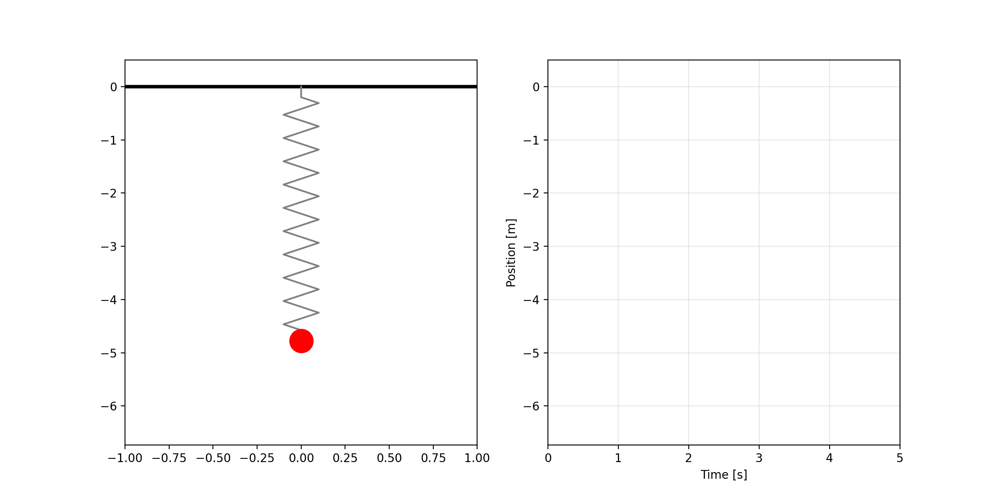

# 「コンテンツ制作のための物理シミュレーション入門（仮）」
この授業では、計算用プログラム(Python)を自身の手で作成しながら、コンピュータシミュレーションを体感してもらいます。

## 背景
### 実社会で扱う物理現象
- 複雑な物理現象を扱う際には、コンピュータシミュレーションが用いられる。
  - 製造業
    - 目標性能を満たしているか。
    - 製品はどのような挙動を示すか観察
  - ゲーム、アニメーション
    - コンテンツ内の物体が物理法則に従い動き、変形する。
      - 水、衣服、ゼリー、…
    - エヴァンゲリオンなどもBlenderの物理シミュレーション機能が活用され、Houdiniを使用したパーティクルのシミュレーションを映像に使用している。（[CGWORLD](https://cgworld.jp/article/202307-cgw299-eva.html)）
- 生成AIによって様々なコンテンツが作れるようになったが、リアリティを検証できるだけのセンスが必要になる。
### この講座のコンセプト
- シミュレーション技術を学ぶ入り口となるような教材を提供したい。
  - 実際にシミュレーション技術を自分の手で動かしながら体感する
    - 機械のシミュレーションやゲームエンジン、アニメーションなどがどのように動いているのかを想像しやすくなってもらう。
    - 物理現象に関する理解を深め、コンテンツのリアリティに対する感性を高めてもらう
### この講義のターゲット
- アニメーションやゲームなどの制作者、ものづくり系エンジニアを目指す人
  - 2025年卒のN高、S高、R高の生徒は、45.54%が大学進学、10.28%が就職している。（[N高、S高、R高 HPより](https://nnn.ed.jp/results/)）
    - 神戸製鋼所などの製造業への就職や、イラストレーター・アーティストなど、コンテンツ制作業界への進出も（[2024年度就職実績](https://nnn.ed.jp/results/job/)）
    - 理系進学をする人は、物理のセンスが重要になる。
  - 進路データはさらに調査したい
### この講義の社会へのインパクト 
- STEM教育からSTEAM教育へ
  - 単なる科学（Science）に芸術・表現（Art）を掛け合わせた「STEAM教育」の重要性が文科省からも提唱されています。
- クリエイターの育成に寄与
  - 世界のゲーム市場の売り上げは、1,888億ドル、プレイヤーは36億人（[参考: Newzoo's Global Games Marlet Report 2025 (Summary)](https://newzoo.com/resources/trend-reports/newzoo-global-games-market-report-2025?utm_source)）
  - アメリカの40%以上のゲーム会社が、3Dゲームデザインエンジンとリアルタイムシミュレーション技術に投資している。（[参考：Market Growth Reports (Summary)](https://www.marketgrowthreports.com/market-reports/3d-gaming-technology-market-116586?utm_source)）
  - クールジャパン戦略では、2.8兆円規模の海外展開がされているゲームではXR・3D対応できる人材育成が重要であると述べられている。（[新たなクールジャパン戦略](https://www.cao.go.jp/cool_japan/aratana/pdf/gaiyou1.pdf)）
- ゲーム・アニメ（2.1兆円）、デジタルツイン（世界約7兆円）市場に直結


## 講座の内容
### 概要
- 計算用プログラムを自身の手で完成させてもらう。
  - バネの振動を題材としたシミュレーション
  - 運動方程式 ($ma = F$) を数値解法を用いて解いています。
  - 結果のグラフやアニメーションを出力・保存


### 計算用プログラム

Python パッケージ管理ツールとして `uv` を使っています。必要な方は[こちら](https://brew.sh/ja/)からHomebrewをインストールして進めてください。

```bash
# uvのインストール
brew install uv

# Pythonのインストール
uv python install

# リポジトリのクローン
git clone https://github.com/hirotakasuzuki1219/python_sim.git
cd python_sim

# 仮想環境の作成とライブラリのインストール
uv venv
uv pip install -r requirements.txt

# プログラムの実行
uv run python main.py
```

### シミュレーションの注意点について理解してもらう
#### 失敗例：不適切な条件設定による誤差、発散



### 多自由度系への拡張
- モデルをより複雑に
  - ゼリーのようなシミュレーション
  - 布のようなシミュレーション
  - Blernder API活用に向けた足がかりに

### Blender Python APIのを活用したシミュレーションの実施
- 既存のソルバーを使って高度なシミュレーションを実現
  - 剛体、布、ソフトボディ（ばねの応用）
  - 水のシミュレーションは計算ロジックが大きく異なるため「おまけ」に

## 授業計画
| 回 | タイトル | 内容 |
| :---: | :--- | --- |
| 1 | はじめに | シミュレーションとは？ |
| 2 | Pythonの文法の紹介 | Forループ、四則演算、… |
| 3 | アニメーション・グラフの作成 | Matplotlibを使った等速直線運動の描画 |
| 4 | 運動方程式の導入($ma = F$) | 自由落下シミュレーション |
| 5 | 接触 | 垂直反力（衝突）、摩擦 |
| 6 | バネを導入したシミュレーション | フックの法則（ $F=kx$ ）の導入 |
| 7 | シミュレーションで生じる誤差 | 不適切な条件設定による発散 |
| 8 | 計算モデルの拡張 | 減衰、空気抵抗など |
| 9 | ソルバーの拡張 | ルンゲクッタ法、（陰解法？） |
| 10 | 多自由度系への拡張 | 複数のバネのシミュレーション（２Dのソフトボディ） |
| 11 | Blenderの物理エンジンを使ってアニメーションを作ってみよう Ⅰ | 剛体 |
| 12 | Blenderの物理エンジンを使ってアニメーションを作ってみよう Ⅱ | 布 |
| 13 | Blenderの物理エンジンを使ってアニメーションを作ってみよう Ⅲ | ソフトボティ |
| 14 | まとめ | シミュレーションの魅力・注意点、発展的なシミュレーションの紹介 |
| おまけ | Blenderの物理エンジンを使ってアニメーションを作ってみよう Ⅳ | 液体（計算ロジックが他と大きく異なるため） |

## 今後の展望
この授業で学んだことを基に、以下のような授業へと発展させたい。
### 他の物理エンジンを活用したシミュレーション
- 実際の開発では、複雑な物体の運動方程式を解くのに既存のソルバーを使うことが多い
  - UnityのNvidia PhysX　等
### ものづくりへの応用
- バンジージャンプのゴムの設計
  - 着水せず、かつ体への衝撃が少ないゴムの条件は？
- 倒立振子ロボットの開発
  - どうやったら転ばない倒立振子ロボット（セグウェイみたいなやつ）が作れるかな？
  - シミュレーション上で制御値を定めて、実際に模型で試してみよう
### 物理教育への活用
- シミュレーションの活用によって物理現象への理解が進むと考えている
  - バネの振動現象、共振など
  - 物理実験との比較により、モデルと実現象の違いを理解
    - 実際のバネはフックの法則（ $F = kx$ ）が成り立っているか？
    - 実験でシミュレーション通りまっすぐ落とせるか？
    - バネはずっと振動しているか？（減衰、空気抵抗、…）